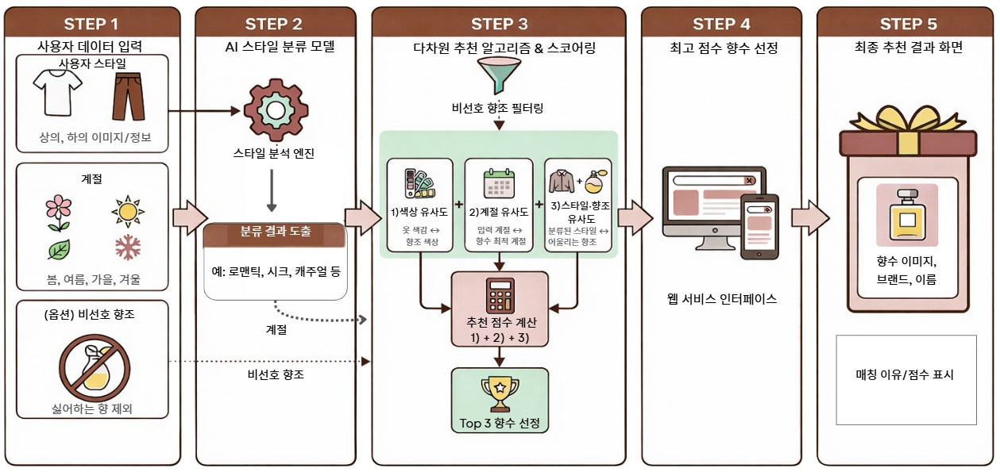
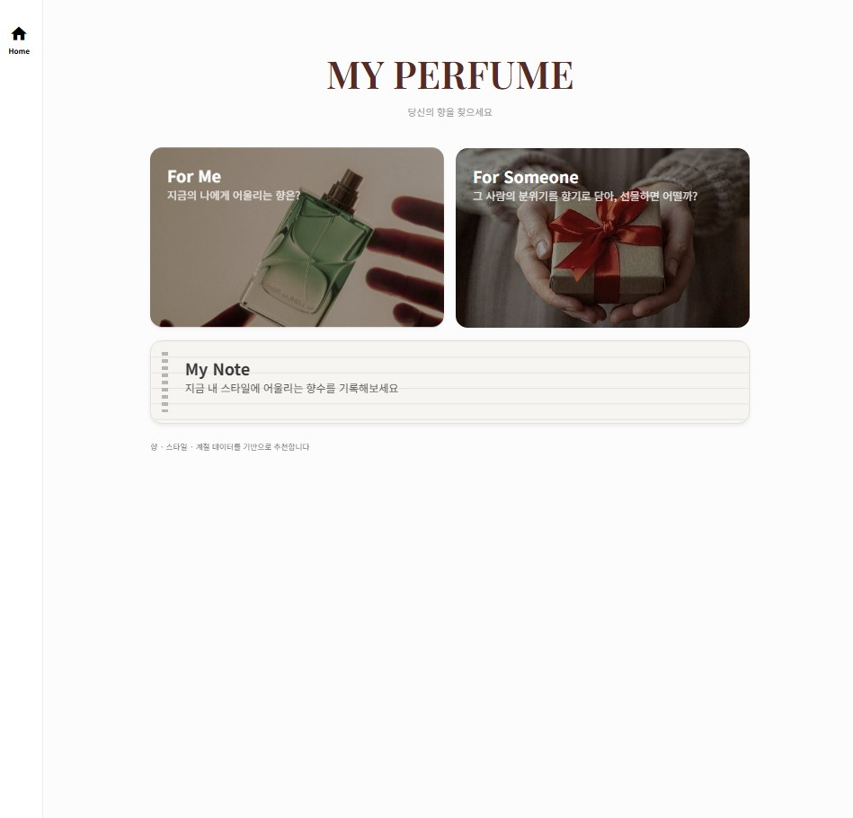
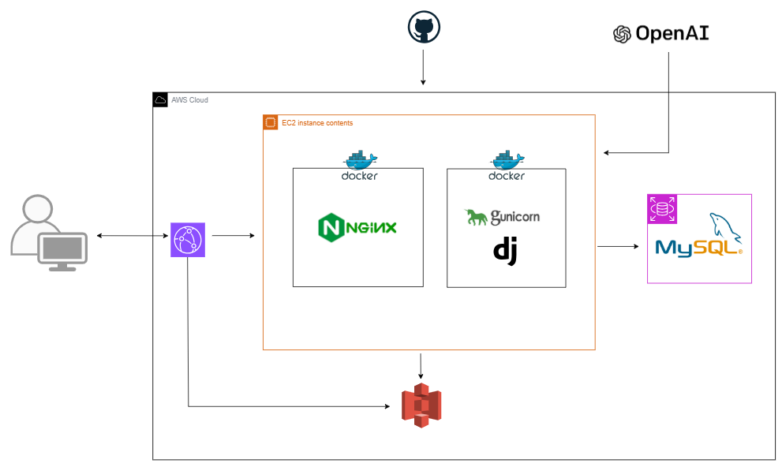

# 🔎 MyPerfume  
**LG U+ Why Not SW Camp 8기**  
양원선 · 이정수 · 김태화

## 📌 프로젝트 개요 
향수 전문 지식이 없어도  
**나에게 어울리는 향을 이해하고 추천 받을 수 있도록** 설계한  
개인화 향수 추천 서비스입니다.

### 핵심 기능 
- 의류 이미지 기반 스타일 분석
- 스타일·색감·계절 맥락을 반영한 추천 알고리즘
- 추천 근거를 자연어로 설명하여 높은 신뢰도 제공

## 🎯 문제 정의 및 접근 

### - 기존의 문제 
* **높은 진입장벽:** 탑/미들/베이스 노트 등 전문 용어 중심의 추천 구조
* **불편한 입력 방식:** 사용자의 취향을 텍스트로 직접 설명해야 하는 번거로움

### - 해결책 
* **3가지 객관적 요소**를 통해 추천의 편의성과 설명력을 높였습니다.

| 사용자 | ⟷ | 향수 | 설명 |
|:--:|:--:|:--:|:--:|
| **스타일 (의류 정보)** | - | **향조** | 패션 무드와 향조 간의 이미지 연관성 반영 |
| **의류 색상** | - | **향조 색상** | 의류 색감과 향기 사이의 공감각적 연결 활용 |
| **향수 사용 계절** | - | **계절 적합도** | 계절 및 기온에 따른 향의 확산력과 지속력 특성 고려 |


## 🧩 서비스 아키텍처



## 🎨 프로토타입
<details>
  <summary>홈 화면</summary>
  <br>
  <div align="center">
    
  </div>
  <p>
    • 서비스 소개 및 진입 화면<br>
    • 향수 추천 / 선물 추천 / 시향 기록으로 이동
  </p>  
</details>

<details>
  <summary>나의 향수 추천</summary>
  <br>
  <div align="center">
    
    
  </div>
  <p>
    • 의류 이미지 기반 스타일 분석<br>
    • 색감·계절을 반영한 개인화 향수 추천<br>
    • 추천 이유 자연어 설명 제공
  </p>
</details>

<details>
  <summary>향수 선물 추천</summary>
  <br>
  <div align="center">
    
    
  </div>
  <p>
    • 선물 대상의 이미지·상황 기반 추천<br>
    • 계절·분위기를 고려한 향수 제안
  </p>
</details>

<details>
  <summary>시향 기록</summary>
  <br>
  <div align="center">
    
    
    
  </div>
  <p>
    • 사용자가 시향한 향수 기록<br>
    • 향에 대한 개인적인 인상 저장
  </p>  
</details>

## 📊 추천 시스템 메커니즘
```
사용자 의류 이미지 & 선호 정보
        ↓
스타일 점수 / 색상 점수 / 계절 점수
        ↓
가중치 최적화 후 최종점수 계산
        ↓
Top-3 향수 추천 + 설명 생성
```
- 모든 점수는 정규화 후 가중치 튜닝
- Precision@k 기준 성능 개선 검증

**[알고리즘 상세 설명 링크](https://github.com/jungsuu-00/MyPerfume/tree/main/code/3_recommendation%20algorithm)**

## 💬 설명 생성
추천 결과에는 단순한 향수 리스트가 아닌,  
**스타일·색감·계절 맥락을 연결한 자연어 설명**을 함께 제공합니다.

- LLM은 설명 생성에만 사용  
- 추천 순위와 점수 계산은 데이터 기반 로직으로 분리 설계  

이를 통해 추천 결과에 대한 **이해도와 신뢰도**를 높였습니다.


## 📈 기대 효과
- 향수 입문자도 추천 결과를 쉽게 이해 가능  
- 개인의 스타일과 상황에 맞는 향수 선택 경험 제공  
- 추천 근거가 명확한 설명 가능한 추천 시스템 구현

## 🗓️ 프로젝트 일정

| 기간 | 수행 내용 |
|---|---|
| **2025.11.21 ~ 2025.11.29** | - 요구사항 정의<br>- 프로젝트 기획<br>- WBS 설계<br>- UI 설계(Figma) |
| **2025.12.02 ~ 2025.12.08** | - 향수 데이터 수집<br>- 의류 이미지 전처리 |
| **2025.12.08 ~ 2025.12.23** | - 스타일 분류 모델 개발<br>- 향수 데이터 전처리<br>- 추천 점수 산정 로직 구현<br>- 추천 알고리즘 개발<br>- LLM 연동 |
| **2025.12.28 ~ 2025.12.30** | - 추천 성능 평가<br>- 가중치 튜닝 및 자동화 |
| **2025.12.03 ~ 2025.12.31** | - Django UI 개발<br>- REST API 구현<br>- DB 설계(MySQL)<br>- Docker · Nginx · Gunicorn · AWS 배포 |

## 🛠️ 시스템구성도


## 💻 기술 스택

### Backend & Frontend
    

### Data / Modeling
    

### Infrastructure
    
  


### Tools
<div>
  
  
  
   
  
</div>


## 💁‍♂️ 프로젝트 팀원

| | | |
|:---:|:---:|:---:|
| **[양원선](https://github.com/oneline47)** | **[이정수](https://github.com/jungsuu-00)** | **[김태화](https://github.com/kimtaehwa001)** |
|  |  |  |
| 팀장 · 기획<br/>데이터 분석 및 모델링 | 프론트엔드 & 백엔드 구축<br/>데이터 모델링 | 클라우드 엔지니어<br/>백엔드 구축 |

### 한 줄 소감 

|팀원|소감|
|----|----|
| 양원선 | ~~~ |
| 이정수 | ~~~ |
| 김태화 | ~~~ |
